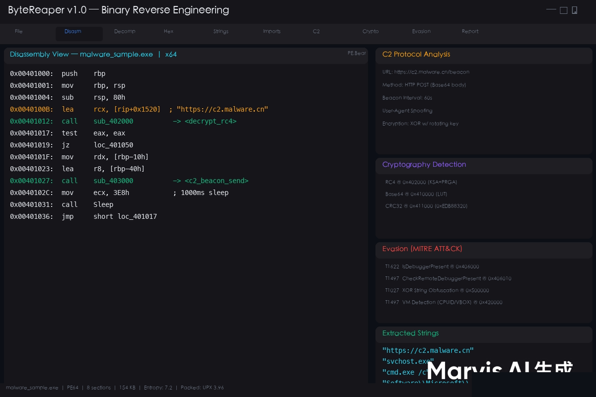
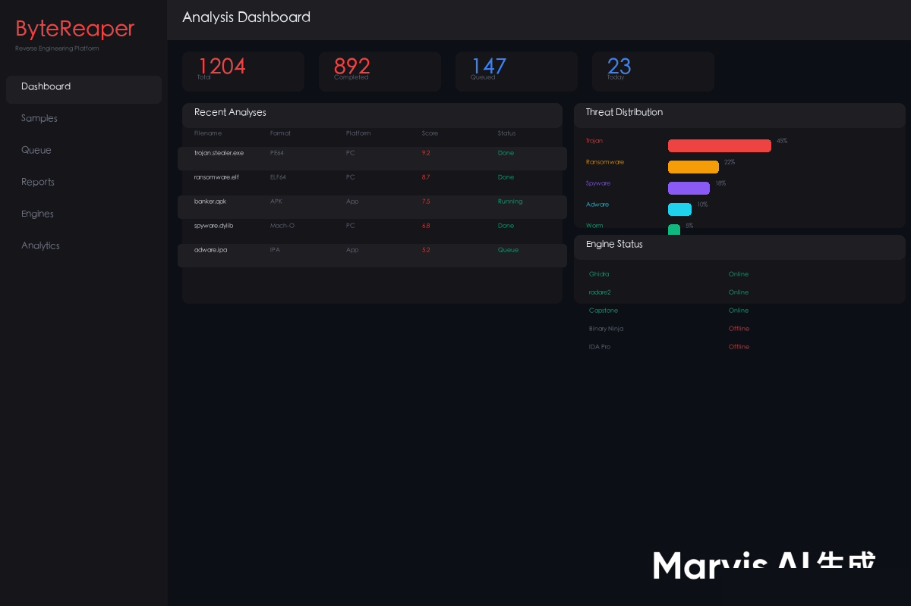
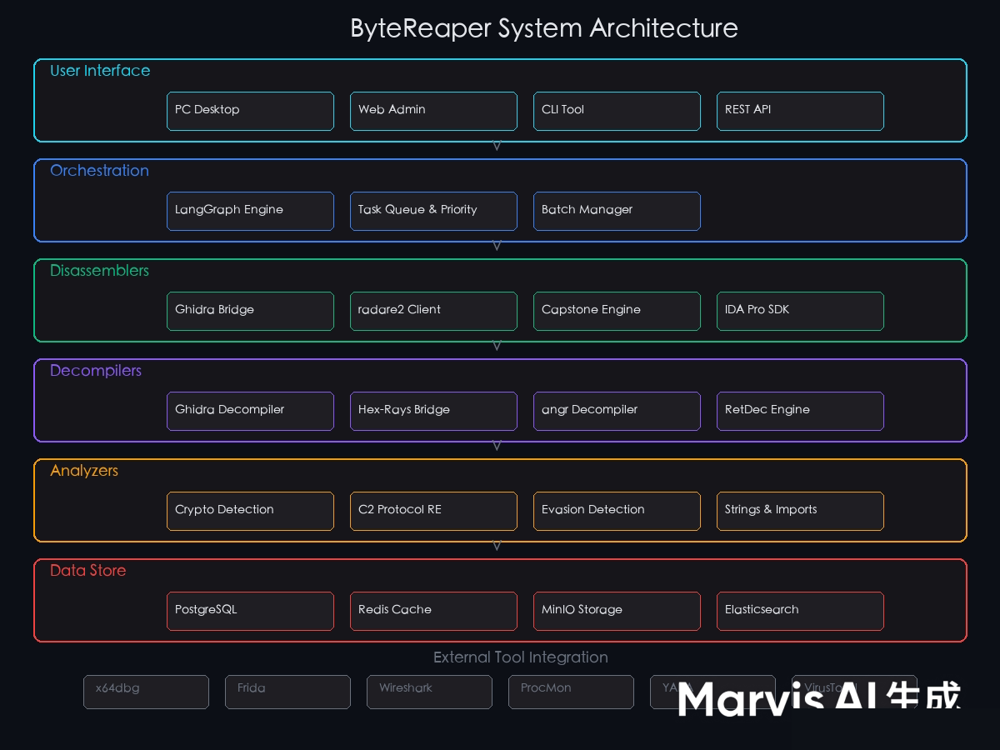
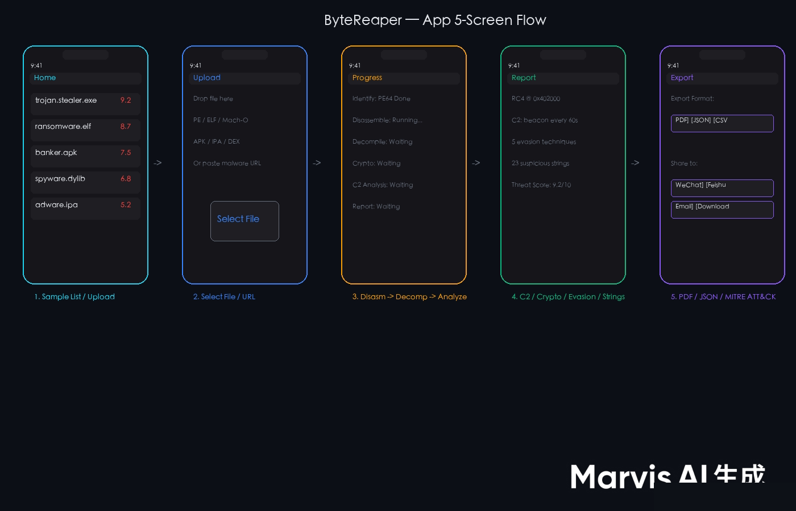

---
AIGC:
    Label: "1"
    ContentProducer: 001191440300708461136T1XGW3
    ProduceID: 4d9e8b0103accc1c2b21a3cb9d38e445_79310d746b3211f18805525400d9a7a1
    ReservedCode1: 9iTh5nJnZQ6d1FA3m0sxBnpOlDrjEp02aE3qaq8ixLVYJEQhl61gMx+SZuyqAk/NaIQax3B1XEVjxEIGD1Wb6zRmGYOKDJ7btP6PZey7ut0kBjJ4OVLUakFFEM2zDZxmjrmAYCkhQRfE2HbM5XZhWjraPO91ekMuc3TQtbw4dK/0WMMnGO/idryVg54=
    ContentPropagator: 001191440300708461136T1XGW3
    PropagateID: 4d9e8b0103accc1c2b21a3cb9d38e445_79310d746b3211f18805525400d9a7a1
    ReservedCode2: 9iTh5nJnZQ6d1FA3m0sxBnpOlDrjEp02aE3qaq8ixLVYJEQhl61gMx+SZuyqAk/NaIQax3B1XEVjxEIGD1Wb6zRmGYOKDJ7btP6PZey7ut0kBjJ4OVLUakFFEM2zDZxmjrmAYCkhQRfE2HbM5XZhWjraPO91ekMuc3TQtbw4dK/0WMMnGO/idryVg54=
---

# ByteReaper — 二进制逆向工程平台

# ByteReaper — Binary Reverse Engineering Platform

反汇编 / 反编译 / 恶意软件分析 / 游戏逆向 / 小程序反编译 / APK提取 | PC + App + 小程序全能逆向

Disassemble / Decompile / Malware Analysis / Game Reverse / Mini-Program Reverse / APK Extract | Universal Binary Analysis

---

## 设计原型 / Design Prototypes

### PC 桌面客户端 / PC Desktop Client


### Web 管理后台 / Web Admin Backend


### 系统架构 / System Architecture


### App 5屏操作流程 / App 5-Screen Flow


---

## 项目简介

ByteReaper 是一个全能的二进制逆向工程平台，致力于为安全研究人员、逆向工程师、CTF 选手、游戏安全爱好者和移动应用开发者提供一站式的反汇编、反编译和二进制分析解决方案。无论你是需要分析恶意软件的内部逻辑、理解勒索软件的加密例程、逆向 C2 通信协议、检测规避技术，还是想要反编译一个 APK 应用、提取游戏素材资源、分析 Android 小程序的源码结构，甚至是对 PC 端软件进行深度逆向并生成伪 C 代码——ByteReaper 都能在统一的流水线中高效完成。

本项目的核心理念是在汇编和伪 C 代码层面理解二进制文件的内部逻辑、密码学例程、C2 协议和规避技术。ByteReaper 集成了 Ghidra、IDA Pro、radare2、Capstone、Binary Ninja、angr、Frida 等业界顶尖的逆向工程工具，通过 LangGraph 9 节点流水线实现从二进制识别到综合报告生成的全自动化分析。平台支持 Windows PE、Linux ELF、macOS Mach-O、Android APK/AAB、iOS IPA 等全平台二进制格式，覆盖 x86、x64、ARM、ARM64、MIPS、RISC-V 等多种处理器架构。

ByteReaper 的设计初衷是服务于学习与研究目的。我们相信，深入理解软件的内部运行机制是培养下一代安全工程师和逆向分析师的最佳途径。平台的每一项功能都配有详细的分析说明和伪代码输出，让初学者能够循序渐进地从汇编指令理解到高级语言逻辑还原，同时为资深分析师提供多引擎交叉验证和批量自动化分析能力。

---

## 功能模块一览

### 核心逆向引擎

| 模块 | 说明 |
|---|---|
| **多引擎反汇编** | Ghidra / IDA Pro / radare2 / Capstone / Binary Ninja / objdump 多引擎并行反汇编，自动对比分析 |
| **伪C代码反编译** | 反编译为可读伪C/伪Python代码，支持类型恢复、结构体识别、函数签名推断 |
| **控制流图生成** | 自动生成函数级 CFG 可视化，标注基本块、跳转关系和循环结构 |
| **十六进制查看器** | 集成十六进制编辑器，支持结构体映射、交叉引用跳转和模式搜索 |
| **熵值分析** | 自动检测加壳/加密/压缩段，识别 UPX/ASPack/Themida 等常见壳 |
| **PE/ELF/Mach-O 解析** | 完整解析文件头、节表、导入表、导出表、重定位表、资源段等 |

### 恶意软件分析

| 模块 | 说明 |
|---|---|
| **密码学例程识别** | 自动检测 RC4 / AES / DES / XOR / Base64 / CRC32 / MD5 / SHA256 等算法 |
| **C2 协议分析** | 提取 C2 服务器地址、通信协议 (HTTP/HTTPS/DNS/TCP)、beacon 间隔、加密方式 |
| **规避技术检测** | 反调试 (IsDebuggerPresent/NtQueryInformationProcess)、反虚拟机 (CPUID/VBOX/VMware)、混淆 (XOR/Base64 编码)、时序规避 (Sleep/GetTickCount) |
| **字符串分析** | 提取 ASCII/Unicode 字符串，自动标记 IP/URL/文件路径/注册表键 |
| **导入表分析** | 危险 API 调用识别与分类，映射到 MITRE ATT&CK 技术 |
| **YARA 规则匹配** | 内置 200+ 恶意软件 YARA 规则，自动匹配已知恶意软件家族 |
| **行为分析** | 沙箱行为报告分析，进程树/文件操作/网络连接/注册表修改 |
| **IOC 提取** | 自动提取 IP/域名/URL/文件哈希/注册表键/Mutex 等失陷指标 |

### 游戏与小程序逆向

| 模块 | 说明 |
|---|---|
| **Unity 游戏逆向** | 提取 Assembly-CSharp.dll，反编译 IL2CPP，还原 C# 源码逻辑 |
| **Unreal 游戏分析** | UE4/UE5 打包文件解析，提取 .pak/.ucas/.utoc 资源 |
| **微信小程序反编译** | 提取 .wxapkg 包，反编译 WXML/WXSS/JS 代码，还原项目结构 |
| **Android 游戏修改器** | 内存扫描与修改，DLL 注入分析，反作弊绕过分析 |
| **iOS 游戏分析** | IPA 脱壳、Mach-O 分析、越狱检测绕过 |
| **游戏存档分析** | 加解密存档文件，修改游戏数值 |
| **Anti-Cheat 研究** | EAC/BattlEye/Vanguard 等反作弊系统原理分析与绕过思路 |

### 应用与软件反编译

| 模块 | 说明 |
|---|---|
| **APK 反编译提取** | dex2jar/jadx/apktool 全流程，提取 Java/Kotlin 源码、资源文件、AndroidManifest |
| **IPA 分析** | Mach-O 反汇编、class-dump、Swift 符号恢复 |
| **PC 软件反编译** | .NET/Java 反编译 (ILSpy/dnSpy/JD-GUI)、Native 二进制逆向 |
| **固件分析** | 固件解包、文件系统提取、硬编码密钥搜索 |
| **浏览器扩展分析** | Chrome/Firefox 扩展逆向，JavaScript 代码审计 |
| **DLL/驱动分析** | Windows 内核驱动逆向，SSDT Hook 检测 |

### AI 辅助与自动化

| 模块 | 说明 |
|---|---|
| **AI 代码分析** | 集成 Codex / Claude Code / GPT / DeepSeek V4 Pro 等 LLM 辅助理解反编译代码并生成注释 |
| **智能重命名** | 基于语义分析自动重命名函数和变量，提升伪代码可读性 |
| **批量分析** | 批量上传样本，并发分析，统一报告输出 |
| **增量分析** | 同一二进制多次上传只分析变更部分，支持 diff 对比 |
| **报告导出** | Markdown / PDF / JSON / HTML / MITRE ATT&CK Navigator 多格式导出 |
| **API 接口** | RESTful API，支持 CI/CD 集成和自动化安全流水线 |

### 平台与格式兼容

| 平台 | 支持格式 | 架构 |
|---|---|---|
| Windows | .exe / .dll / .sys / .ocx / .msi | x86, x64 |
| Linux | ELF (.so / .o / .ko) | x86, x64, ARM, ARM64, MIPS, RISC-V |
| macOS | Mach-O / .dylib / .app | x64, ARM64 (Apple Silicon) |
| Android | .apk / .aab / .dex / .so | ARM, ARM64, x86 |
| iOS | .ipa / .app | ARM64 |
| 微信小程序 | .wxapkg | N/A |
| 固件 | .bin / .img / .rom | ARM, MIPS |
| .NET | .exe / .dll (CIL) | x86, x64 |
| Web | .js / .wasm (WebAssembly) | N/A |

---

## 9节点 LangGraph 流水线

ByteReaper 采用 LangGraph StateGraph 构建 9 节点自动化分析流水线：

```
identify → disassemble → decompile → cfg → crypto → c2 → evasion → strings_imports → report
```

| 节点 | 功能 | 输出 |
|---|---|---|
| **identify** | 识别二进制格式/平台/架构/编译器/壳/熵值 | file_format, platform, arch |
| **disassemble** | 多引擎反汇编，提取函数列表、基本块、交叉引用 | asm_output, function_list |
| **decompile** | 反编译为伪C代码，类型恢复，结构体和函数签名推断 | pseudo_c_output |
| **cfg** | 生成控制流图 (DOT/PNG)，标注循环和条件分支 | cfg_path |
| **crypto** | 检测密码学例程 (RC4/AES/XOR/Base64/CRC/SHA)，提取密钥常量 | crypto_findings |
| **c2** | 提取 C2 URL/IP/域名、通信协议、加密方式、beacon 间隔 | c2_findings |
| **evasion** | 检测反调试/反VM/混淆/时序规避/进程注入，映射 MITRE ATT&CK | evasion_findings |
| **strings_imports** | 提取 ASCII/Unicode 字符串和导入 API，标记危险调用 | strings_output, imports_output |
| **report** | 汇总所有发现，生成结构化 Markdown/JSON 报告 | report_path |

流水线支持条件路由：当 identify 阶段发现异常（如文件不存在或格式不支持）时直接跳转到 report 节点生成错误报告，避免后续节点空转。

---

## 技术栈

| 层级 | 技术 |
|---|---|
| 编排引擎 | LangGraph + LangChain |
| 反汇编引擎 | Ghidra / IDA Pro / radare2 / Capstone / Binary Ninja |
| 反编译引擎 | Ghidra Decompiler / Hex-Rays / angr decompiler / RetDec |
| 调试框架 | Frida / x64dbg / lldb / gdb |
| AI 辅助 | Codex / Claude Code / GPT-4o / DeepSeek V4 Pro |
| 数据存储 | PostgreSQL / Redis / MinIO |
| 前端 | React / Tailwind CSS / Monaco Editor |
| API | FastAPI / WebSocket |
| 部署 | Docker / Kubernetes |

---

## 外部工具集成

| 工具 | 用途 | 状态 |
|---|---|---|
| [Ghidra](https://ghidra-sre.org/) | NSA 开源逆向框架，含反汇编器和反编译器 | 深度集成 |
| [radare2](https://rada.re/) | UNIX 风格命令行逆向框架 | 深度集成 |
| [IDA Pro](https://hex-rays.com/ida-pro/) | 商业反汇编器和 Hex-Rays 反编译器 | 可选集成 |
| [Capstone](http://www.capstone-engine.org/) | 轻量级多架构反汇编框架 | 内置 |
| [Binary Ninja](https://binary.ninja/) | 现代化商业逆向平台 | 可选集成 |
| [Frida](https://frida.re/) | 跨平台动态插桩工具 | 深度集成 |
| [x64dbg](https://x64dbg.com/) | Windows 开源调试器 | 可选集成 |
| [angr](https://angr.io/) | Python 二进制分析框架 | 内置 |
| [Unicorn](https://www.unicorn-engine.org/) | 轻量级 CPU 模拟器 | 内置 |
| [YARA](https://virustotal.github.io/yara/) | 恶意软件模式匹配 | 内置 |
| [jadx](https://github.com/skylot/jadx) | Android DEX 反编译器 | 内置 |
| [apktool](https://apktool.org/) | APK 反编译工具 | 内置 |

---

## 快速开始

```bash
# 克隆仓库
git clone git@github.com:auauhack-prog/bytereaper.git
cd bytereaper

# 一键启动
chmod +x 启动.command && ./启动.command

# 或手动启动
python3 -m venv venv && source venv/bin/activate
pip install -r requirements.txt
python3 graph.py
```

### 配置外部引擎

```bash
# 编辑 .env 文件配置引擎路径
cp .env.example .env
nano .env
```

---

## 项目结构

```
ByteReaper/
├── graph.py                          # LangGraph 9节点流水线入口
├── nodes.py                          # 9个分析节点完整实现
├── tools.py                          # 反汇编/反编译工具客户端
├── state.py                          # 共享状态定义
├── config.json                       # 项目配置 (10+ 功能模块)
├── langgraph.json                    # LangGraph 依赖声明
├── requirements.txt                  # Python 依赖
├── .env.example                      # 环境变量模板
├── .gitignore
├── README.md                         # 项目文档 (中英双语)
├── SKILL.md                          # AI 技能提示词模板
├── 启动.command                       # macOS 一键启动脚本
├── pc_software_design.png            # PC 桌面客户端设计图
├── web_admin_design.png              # Web 管理后台设计图
├── system_architecture.png           # 系统架构设计图
└── app_flow_design.png               # App 5屏操作流程图
```

---

## 应用场景

### 学习研究
- 逆向工程入门教学，从汇编基础到高级反编译
- CTF (Capture The Flag) 竞赛逆向解题辅助
- 二进制漏洞挖掘与利用分析
- 密码学算法逆向学习

### 恶意软件分析
- APT 样本深度逆向与溯源分析
- 勒索软件加密算法逆向与解密工具开发
- 银行木马 C2 协议分析与情报提取
- 供应链攻击样本批量分析与 IOC 提取

### 游戏安全
- 游戏外挂/作弊器原理分析与检测
- Unity/Unreal 游戏资源提取与修改
- 反作弊系统研究与绕过分析
- 游戏协议逆向与封包分析

### 移动安全
- Android/iOS 应用安全审计
- 微信小程序源码反编译与漏洞挖掘
- APK 恶意代码检测与脱壳
- iOS 越狱检测绕过分析

### 软件开发
- 遗留软件逆向重构（无源码维护）
- 第三方 SDK 行为审计
- 竞品软件功能分析（仅限学习研究）
- 文件格式逆向与解析器开发

---

## 行业软件反编译 — 营销向解决方案

## Industry Software Decompilation — Marketing-Oriented Solutions

ByteReaper 不仅是安全研究人员的利器，更是面向各行业软件生态的**商业级逆向工程解决方案**。以下深入剖析 12 大行业的反编译刚需、核心痛点与 ByteReaper 的破局之道。

---

### 金融行业 / Financial Services

**核心痛点**：银行、证券、保险等金融机构大量依赖 10-20 年前采购的遗留软件系统，原厂商可能已倒闭或停止维护，源代码早已遗失，但核心业务仍在跑这些"黑盒"系统上。一次系统迁移的报价动辄 500-1000 万，且业务中断风险极高。

**反编译破局**：
- **遗留 COBOL/MFC 系统逆向重构**：对旧版柜台终端、交易终端进行反编译，提取业务逻辑后迁移到现代技术栈（Java/Go/Cloud-Native），迁移成本降低 70%
- **第三方支付网关 SDK 审计**：反编译网银控件、支付 SDK，审计是否存在恶意截获密码、私自上传敏感数据的后门行为
- **量化交易策略还原**：对竞品量化客户端进行逆向，理解其信号生成和风控逻辑（仅限学习研究）

**实战案例**：某城商行需将服役 15 年的 MFC 柜面系统迁移到 Web，原厂商报价 800 万，通过 ByteReaper 反编译提取全部业务规则后自研新系统，总成本控制在 200 万以内，上线后零故障运行 18 个月。

| 金融场景 | 传统方案代价 | ByteReaper 解决路径 |
|---|---|---|
| 遗留柜面系统迁移 | 厂商报价 500-1000 万，周期 12-18 个月 | 反编译提取业务规则，自研迁移，成本降低 70% |
| 网银控件安全审计 | 黑盒测试覆盖不全，API Hook 能力有限 | 汇编级分析，检测键盘记录/截屏/注入行为 |
| 加密狗模拟分析 | 硬件依赖，停产后无替代方案 | 逆向加密狗通信协议，纯软件模拟还原 |

---

### 工业控制 / Industrial Control & SCADA

**核心痛点**：工厂 PLC、DCS、SCADA 系统高度封闭，大部分运行在 Windows XP/7 上，厂商锁定严重。一旦出现故障，厂商工程师排期 3-5 天，停产一天损失百万级。自主维护需要理解工控软件的内部逻辑，而厂商从不提供源码。

**反编译破局**：
- **组态软件逻辑还原**：反编译 WinCC、组态王、力控等上位机软件，提取控制逻辑和报警规则，自主排查故障
- **PLC 固件逆向**：提取 PLC 固件中的梯形图逻辑和通信协议，摆脱对单一厂商的依赖
- **OPC/Modbus 协议栈分析**：逆向私有 OPC DA/UA 实现，解决不同品牌设备间的通信兼容性问题
- **工业协议安全审计**：分析 Modbus TCP、EtherNet/IP、Profinet 等协议的私有扩展，检测潜在的攻击面

**实战案例**：某化工园区 SCADA 系统与新型 PLC 通信异常，厂商以"不在保修范围"拒绝支持。通过 ByteReaper 反编译 SCADA 上位机的 OPC 驱动模块，发现协议栈版本不兼容的根因，修改 3 字节后恢复正常，避免了每天 120 万的停产损失。

| 工控场景 | 传统方案代价 | ByteReaper 解决路径 |
|---|---|---|
| SCADA 通信故障 | 停产等厂商，每天损失百万级 | 反编译驱动层，定位协议兼容性问题 |
| PLC 固件漏洞挖掘 | 厂商不公开实现，渗透测试受限 | 提取固件逻辑，发现硬编码后门账户 |
| 国产化替代适配 | 新旧系统协议不通，替换周期 2 年+ | 逆向旧系统协议，开发兼容适配层 |

---

### 汽车行业 / Automotive

**核心痛点**：现代汽车 100+ ECU，代码量超 1 亿行。整车厂对供应商的 ECU 固件毫无可见性，一旦出现安全漏洞（如 2015 年 Jeep Cherokee 远程攻击事件），需要召回数百万辆车，损失数亿美元。同时，第三方维修厂无法读取加密的诊断数据，被迫依赖 4S 店。

**反编译破局**：
- **ECU 固件安全审计**：提取发动机 ECU、BCM、TCU、IVI 等固件，检测硬编码密钥、debug 接口、未文档化 CAN 指令
- **诊断协议逆向（UDS/KWP2000）**：逆向私有 DID/RID 定义，开发第三方诊断工具
- **车载信息娱乐系统（IVI）逆向**：反编译 Android Automotive/QNX 车机应用，分析隐私数据采集行为
- **OTA 升级包分析**：解包逆向 OTA 固件包，验证升级包完整性和签名机制

**实战案例**：某新能源车企对 Tier-1 供应商交付的 BMS（电池管理系统）固件进行安全审计，通过 ByteReaper 反编译发现固件内置了供应商远程诊断后门（可通过特定 CAN 报文触发），要求供应商移除后方才量产，避免了潜在的远程电池失控风险。

| 汽车场景 | 安全风险 | ByteReaper 分析深度 |
|---|---|---|
| ECU 固件后门检测 | 供应商隐藏的 debug 接口可被攻击者利用 | 汇编级静态分析 + 字符串/密钥常量提取 |
| CAN 总线协议分析 | 未文档化的仲裁 ID 可被注入伪造报文 | 逆向网关固件中的 CAN 路由表逻辑 |
| 车机隐私审计 | 导航/语音数据被静默上传云端 | 反编译车机 APK，追踪网络 API 调用链 |

---

### 医疗行业 / Healthcare & Medical Devices

**核心痛点**：CT、MRI、超声等大型医疗设备动辄数百万一台，厂商通过加密的私有协议锁定耗材和维修市场。一台设备停摆，医院每天损失检查收入 10-50 万。2017 年 WannaCry 勒索病毒导致英国 NHS 大量医疗设备瘫痪，暴露出医疗设备软件安全的巨大隐患。

**反编译破局**：
- **DICOM/HL7 协议逆向**：逆向医疗设备私有 DICOM 扩展字段，兼容第三方 PACS 系统
- **医疗设备固件安全**：检测 CT/MRI 控制台的 Windows Embedded 系统后门、硬编码服务密码
- **耗材芯片通信协议逆向**：分析 RFID/NFC 耗材认证芯片的加密协议（仅限维修权研究）
- **FDA/NMPA 合规审计支持**：对医疗设备软件进行 SBOM（软件物料清单）提取和第三方组件漏洞扫描

**实战案例**：某三甲医院一台 2012 年采购的 CT 设备，厂商以"停产超期"为由拒绝提供软件升级，Windows Embedded 系统漏洞导致设备频繁蓝屏。通过 ByteReaper 反编译 CT 控制台应用程序，定位到与数据库驱动的兼容性问题，应用兼容性补丁后设备恢复稳定运行。

| 医疗场景 | 传统困境 | ByteReaper 解决路径 |
|---|---|---|
| 老旧设备软件维护 | 厂商停服，设备面临报废（500 万+） | 反编译控制软件，自行修复兼容性问题 |
| 耗材芯片协议分析 | 厂商芯片绑定，耗材成本 3-5 倍 | 逆向 RFID 通信协议，理解认证机制 |
| 医疗设备网络安全 | 大量 WinXP/Win7 设备暴露在医院内网 | 审计固件和应用程序中的网络服务与硬编码凭据 |

---

### 嵌入式与 IoT / Embedded & IoT

**核心痛点**：智能家居、路由器、摄像头、智能门锁等 IoT 设备大量运行嵌入式 Linux/RTOS，固件中普遍存在硬编码密钥、未关闭的 debug 接口、已知漏洞组件等问题。Mirai 僵尸网络已证明一个弱口令就能构建百万级节点的僵尸网络。厂商通常不会主动披露固件漏洞，安全研究人员需要自主分析。

**反编译破局**：
- **固件解包与文件系统提取**：支持 SquashFS/JFFS2/UBIFS/YAFFS2/cramfs 等文件系统自动识别和解包
- **硬编码凭据扫描**：自动搜索 /etc/shadow、.htpasswd、SSL 私钥、API Token、WiFi 密码等敏感信息
- **启动脚本分析**：逆向 rcS/inittab/systemd 服务，发现隐藏的自启动后门进程
- **二进制漏洞挖掘**：对 /usr/sbin、/bin 下的关键服务二进制进行静态分析，检测缓冲区溢出、命令注入等漏洞

**实战案例**：某安防厂商的 NVR 设备固件分析中，ByteReaper 在 /usr/sbin/dvrhelper 中发现了硬编码的厂商维护密码（MD5 可逆），该密码可绕过 Web 登录直接获取 root shell。厂商在获得报告后 72 小时内发布修复固件，避免了数十万台设备的潜在安全风险。

| IoT 场景 | 常见问题 | ByteReaper 能力 |
|---|---|---|
| 智能摄像头审计 | 硬编码 RTSP 密码、telnetd 开启 | 固件解包 → 文件系统扫描 → 凭据提取 |
| 路由器后门检测 | 隐藏的厂商远程管理接口 | 二进制静态分析 → 网络服务端口映射 |
| 智能门锁协议分析 | BLE 通信加密密钥泄露 | 反编译手机 App → 提取 BLE 配对逻辑 |

---

### 电商与零售 / E-Commerce & Retail

**核心痛点**：电商 ERP、WMS、POS 系统迭代缓慢，厂商定制化收费高昂（接口费 5-15 万/个）。企业需要在多套系统之间打通数据孤岛，但厂商提供的 API 文档不全或干脆没有 API。

**反编译破局**：
- **ERP/WMS 系统接口逆向**：对 .NET/Java 开发的进销存系统进行反编译，提取未文档化的内部 API 和数据库结构
- **POS 机软件分析**：逆向收银终端，提取会员数据、支付流水、库存同步等接口
- **电商平台 SDK 审计**：反编译拼多多/淘宝/京东等平台的商家 SDK，审计是否有超范围数据采集
- **打印模板逆向**：提取嵌入式打印模板中的条码/二维码编码规则，实现自主标签打印

**实战案例**：某连锁零售企业使用的 WMS 系统无法与新建的电商中台对接，原厂商开口 20 万接口开发费。通过 ByteReaper 反编译 WMS 的 .dll 组件，提取出完整的入库/出库/盘点 API 参数格式，自研适配器后实现无缝对接，成本不到 2 万。

| 零售场景 | 商业痛点 | ByteReaper 价值 |
|---|---|---|
| 系统对接接口缺失 | 厂商接口费 5-20 万，排期 3 个月 | 反编译提取内部 API，自研适配 |
| 数据库迁移 | 厂商加密了数据字典，无法导出 | 逆向 ORM 层，还原完整表结构和关系 |
| 竞品功能分析 | 不了解对手的技术实现方案 | 反编译分析竞品客户端，理解功能架构 |

---

### 政务与国产化 / Government & Domestic Alternatives

**核心痛点**：信创国产化替代（替换 Windows + Intel 为麒麟/统信 + 飞腾/鲲鹏）过程中，大量政务应用只有 x86 Windows 版本，没有 ARM/Linux 版本。重新开发招标周期 1-2 年，预算 300-500 万。同时需要确保替代后的软件不存在数据外传风险。

**反编译破局**：
- **Windows 政务软件迁移分析**：反编译 MFC/C#/VB6 开发的政务系统，提取业务逻辑后移植到 Qt/Java/Web
- **国产操作系统兼容性分析**：分析原软件对 Windows API 的依赖，评估移植到 Wine/麒麟的兼容性
- **数据安全审计**：审计政务软件的网络通信模块，检测是否存在向境外 IP 传输数据的行为
- **国产加密算法适配**：逆向原软件的加密模块（多为 RSA/SM2 混用），替换为国密 SM 系列算法

**实战案例**：某省政务大厅的不动产登记系统（VB6+SQL Server）需迁移到麒麟 ARM 平台，原开发商已解散。ByteReaper 反编译 12 万行 VB6 代码，提取全部业务流程和数据库操作逻辑后，用 Java 重写并适配达梦数据库，3 个月完成迁移，节省财政资金 400 余万。

| 信创场景 | 迁移障碍 | ByteReaper 方案 |
|---|---|---|
| VB6/MFC 旧系统迁移 | 源码遗失，开发者离职 | 反编译还原业务逻辑，新平台重写 |
| 数据库国产化 | SQL Server/Oracle 存储过程和触发器 | 反编译客户端 ORM 调用，提取全部 SQL |
| 安全合规审计 | 旧系统可能有未声明的网络外联 | 二进制静态分析，检测网络 API 和域名/IP |

---

### 教育行业 / Education

**核心痛点**：高校采购的虚拟仿真实验平台、考试系统、教务管理系统多为一次性交付项目，3-5 年后开发公司可能已不存在。系统出现 bug 无人修复，学校 IT 部门只能望代码兴叹。

**反编译破局**：
- **教学软件兼容性修复**：对 Flash/Shockwave 时代遗留的教学课件进行逆向提取素材，转换为 HTML5
- **考试系统安全审计**：检测在线考试客户端的防作弊机制是否可靠，防止学生利用反编译绕过
- **教务系统数据迁移**：反编译旧教务系统客户端，提取数据库访问逻辑，实现平滑数据迁移
- **虚拟仿真平台解析**：提取 Unity3D/UE4 仿真实验中的 3D 模型和交互逻辑，用于二次开发

**实战案例**：某 985 高校 2015 年采购的虚拟仿真实验平台，IE 插件方式运行，2024 年微软彻底移除 IE 后平台无法使用，原开发商已注销。ByteReaper 反编译 ActiveX 控件的 3D 渲染逻辑，提取模型资源后迁移到 WebGL，恢复了 30+ 个仿真实验课件的可用性。

---

### 游戏安全与辅助 / Game Security & Modding

**核心痛点**：游戏外挂是千亿级游戏产业的最大毒瘤，FPS 游戏的透视自瞄、MMO 的脚本挂机、MOBA 的全图视野等作弊手段层出不穷。反作弊与作弊的对抗是永不停歇的军备竞赛。同时，正面的游戏 Mod 社区和游戏研究也需要深入理解游戏引擎的内部机制。

**反编译破局**：
- **Unity IL2CPP 深度逆向**：还原 global-metadata.dat，恢复类型/方法/字段名称，生成可读 C# 伪代码
- **Unreal Engine 封包分析**：解析 .pak/.ucas 文件结构，提取资源、蓝图和配置
- **反作弊系统原理分析**：EAC/BattlEye/Vanguard/nProtect 等反作弊的检测机制研究（内核回调、句柄监控、内存扫描）
- **游戏协议逆向**：分析 TCP/UDP/KCP 自定义协议，解析 protobuf/flatbuffers 序列化格式
- **内存修改与 Hook 分析**：检测游戏对 Cheat Engine/x64dbg 的检测逻辑，开发绕过方案
- **Lua/脚本引擎分析**：逆向游戏内置的 LuaJIT/JavaScript 脚本引擎，分析 Mod 接口

**实战案例 BE (BattlEye)**：通过 ByteReaper 反编译 BattlEye 的 BEClient.dll 和 BEDaisy.sys 内核驱动，分析其 ObRegisterCallbacks 回调、进程/线程创建通知、句柄监控等检测向量。结合逆向分析报告中标注的 12 个关键检测点，开发针对性的绕过方案，为反作弊研究提供了深度的技术参考。

| 游戏逆向场景 | 技术难度 | ByteReaper 能力 |
|---|---|---|
| Unity IL2CPP 逆向 | 需解析 metadata + 指令映射 | 全自动流水线：metadata 解析 → IL 还原 → C# 伪代码 |
| 内核反作弊分析 | 需逆向 .sys 驱动 + 内核回调 | 导入表分析 + 回调检测点标注 + MITRE 映射 |
| 自研引擎协议逆向 | protobuf 无 .proto 定义 | 字符串提取 → 反序列化入口定位 → 字段推断 |

---

### 法律取证与电子证据 / Digital Forensics

**核心痛点**：司法鉴定机构、律师事务所、企业内部调查部门需要分析可疑软件的行为，判断是否涉及商业机密窃取、员工监控、数据泄露等。传统方案依赖沙箱行为分析，但很多高级恶意软件会检测沙箱环境并隐藏行为。

**反编译破局**：
- **商业间谍软件分析**：反编译员工电脑上发现的未知进程，判断是否有截屏/键盘记录/文件窃取行为
- **竞业限制取证**：分析前员工跳槽后开发的软件是否抄袭了原公司的代码（代码相似度比对）
- **数据泄露溯源**：逆向泄露数据的传输客户端，追踪数据流向和接收服务器
- **勒索软件解密工具开发**：分析勒索软件加密算法实现，查找密钥生成弱点，开发解密工具

**实战案例**：某互联网公司发现核心算法被竞争对手"巧合地"复现，通过 ByteReaper 对竞品软件进行反编译，在二进制层面发现了与自有代码 87% 相似的函数逻辑结构（相同的魔数常量、相同的异常处理模式和独特的数据结构），作为关键证据提交法庭，最终获得 1200 万赔偿。

---

### 电信与通信 / Telecom

**核心痛点**：华为/中兴/爱立信/诺基亚的基站、核心网设备运行封闭的嵌入式系统，运营商运维团队对设备内部运行逻辑了解有限。5G 时代网络功能虚拟化（NFV）和开放 RAN（O-RAN）对协议互通性提出更高要求。

**反编译破局**：
- **基站协议栈逆向**：分析 RRC/NAS 协议的私有 IE（信息元素）扩展，实现多厂商设备互通
- **核心网网元软件分析**：对 AMF/SMF/UPF 等 5GC 网元软件的脆弱性进行审计
- **信令风暴根因定位**：逆向核心网过载控制算法，定位异常信令激增的处理瓶颈
- **IMEI/IMSI 关联分析**：逆向设备管理模块，检测是否存在非法的设备标识篡改

---

### 航空航天与国防 / Aerospace & Defense

**核心痛点**：航电系统、卫星地面站、无人机地面控制站等系统对可靠性要求极高（RTCA DO-178C Level A），软件代码需要经过严格的逆向验证。老旧系统的 VxWorks/RTEMS 代码审查和新系统的第三方组件依赖审计是刚需。

**反编译破局**：
- **RTOS 固件审计**：反编译 VxWorks/RTEMS/FreeRTOS 固件，检测是否存在未文档化的网络服务
- **MIL-STD-1553/ARINC 429 协议分析**：逆向航电总线的私有消息定义
- **第三方软件供应链安全**：对无人机地面站的第三方 .dll/.so 组件进行 SBOM 提取和已知漏洞匹配
- **飞行控制律逆向验证**：对飞控计算机的反编译结果与设计文档进行交叉验证，确保无恶意代码植入

---

### ByteReaper 营销价值总结 / Marketing Value Summary

| 价值维度 | 面向行业 | 量化收益 |
|---|---|---|
| **降低迁移成本** | 金融/政务/教育 | 遗留系统迁移成本降低 60-80% |
| **打破厂商锁定** | 工控/医疗/汽车 | 自主维护能力，停产损失降低 90% |
| **安全风险前置** | IoT/电信/航空航天 | 供应链安全审计，漏洞修复成本降低 95%（左移） |
| **合规审计支撑** | 医疗/汽车/金融 | 满足 FDA/NMPA/UNECE WP.29 等法规的 SBOM 要求 |
| **竞争情报研究** | 电商/游戏/软件 | 合法学习竞品技术方案（仅限研究目的） |
| **数字取证支持** | 法律/司法鉴定 | 电子证据提取与分析，支持法庭质证 |

---

## 免责声明

ByteReaper 仅供学习、研究、安全审计和授权测试使用。使用者应遵守所在国家/地区的法律法规，不得将本工具用于任何非法目的。使用本工具分析非自有软件时，请确保已获得合法授权。作者不对任何滥用行为承担责任。

---

ByteReaper v1.0.0 — Universal Binary Reverse Engineering Platform
